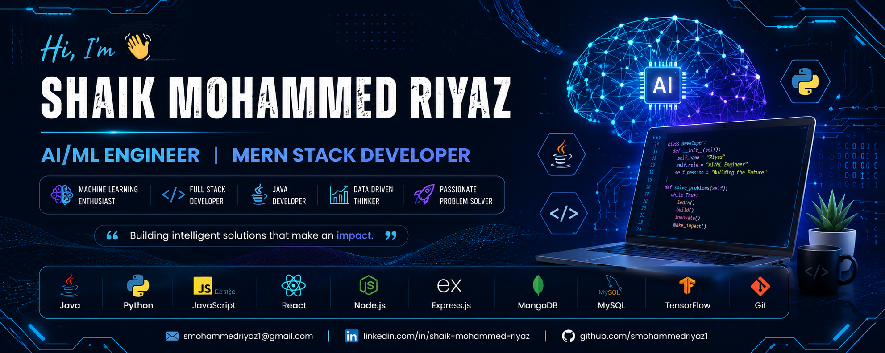

<!-- <p align="center">
  
</p> -->


<h1 align="center">👋 Hi, I'm Shaik Mohammed Riyaz</h1>

<h3 align="center">🤖 AI/ML Engineer | GenAI Developer | Java Developer</h3>

<p align="center">
  
</p>

<p align="center">
  <a href="mailto:smohammedriyaz1@gmail.com">
    
  </a>
  <a href="https://github.com/smohammedriyaz1">
    
  </a>
  <a href="https://www.linkedin.com/in/s-mohammed-riyaz">
    
  </a>
</p>

---

## 🚀 About Me

🎓 **Computer Science Graduate** | 📍 Bengaluru, India

I build practical **AI/ML and software applications**, combining machine learning, Generative AI and full-stack development.

```text
             🚀 SOFTWARE + AI
                    │
        ┌───────────┼───────────┐
        ↓           ↓           ↓
     🤖 AI/ML     🧠 GenAI    💻 Software
        │           │           │
   ML • DL      LLM • RAG    Java • MERN
   CV • NLP     Agents       SQL • APIs
```

---

## 🧠 AI/ML Toolkit

**Machine Learning**
`Scikit-learn` • `Pandas` • `NumPy` • `Matplotlib` • `XGBoost`

**Deep Learning**
`PyTorch` • `TensorFlow` • `ANN` • `CNN`

**Generative AI**
`LLMs` • `RAG` • `Embeddings` • `Vector DB` • `Prompt Engineering` • `AI Agents`

**Computer Vision**
`OpenCV` • `MediaPipe` • `Pose Estimation`

---

## 💻 Development Stack

<p align="center">

</p>

**Core:** Java • Python • SQL • DSA

**Backend:** Node.js • Express.js • Flask • REST APIs

**Frontend:** React.js • HTML • CSS

**Database:** MongoDB • MySQL

**Tools:** Git • GitHub • Docker • Linux • Postman • Streamlit

---

## 🔥 Featured Projects

### 🤖 AI Gym Coach

**Real-Time Computer Vision + GenAI**

`Python` `OpenCV` `MediaPipe` `Streamlit` `Groq` `gTTS`

> 🏋️ Pose Detection → Exercise Recognition → Rep Counting → AI Guidance → 🔊 Voice Feedback

---

### 📚 RAG AI Application

**Document Question-Answering System**

`Python` `RAG` `LLM` `ChromaDB` `Embeddings` `Flask`

> 📄 Documents → ✂️ Chunking → 🧠 Embeddings → 🔎 Retrieval → 🤖 LLM Response

🔗 https://github.com/smohammedriyaz1/RAG

---

### 🏥 NovaGen Health Risk Prediction

**Machine Learning Prediction System**

`Python` `Pandas` `NumPy` `Scikit-learn`

> 📊 Data → ⚙️ Preprocessing → 🧠 ML Model → 📈 Evaluation → 🔮 Prediction

🔗 https://github.com/smohammedriyaz1/NovaGen-Health-Risk-Prediction

---

### 🛒 Smart Cart System

**Customer Segmentation using ML**

`Python` `Scikit-learn` `K-Means` `Clustering`

> 👥 Customer Data → 📊 Analysis → 🔵 Clustering → 🎯 Segmentation

---

### 🧠 Deep Learning

**ANN + CNN Projects**

`PyTorch` `TensorFlow` `CIFAR-10` `Date Fruit` `Energy Prediction`

---

### 🏠 Atlas Stay

**MERN Property Booking Platform**

`MongoDB` `Express.js` `React.js` `Node.js` `Cloudinary`

> 👤 Auth → 🏠 Listings → 🔍 Search → 📸 Images → 📅 Booking

---

## 📊 What I Work With

```text
AI/ML
 ├── Machine Learning
 ├── Deep Learning
 ├── Computer Vision
 └── Data Science

GENERATIVE AI
 ├── LLMs
 ├── RAG
 ├── Embeddings
 ├── Vector Databases
 └── AI Agents

SOFTWARE
 ├── Java + DSA
 ├── Python
 ├── MERN Stack
 ├── REST APIs
 └── SQL
```

---

## 🌱 Currently Building

`Generative AI` → `RAG` → `LLM Applications` → `AI Agents` → `Agentic AI`

🎯 Also improving **DSA • Java • Deep Learning • System Design • Open Source**

---

## 🏆 Certifications

`Oracle Java` • `AWS Cloud` • `IBM AI/ML` • `IBM SQL` • `NPTEL` • `Microsoft AI` • `Apna College DSA` • `SkillForge ML` • `ExcelR MERN`

---

## 📈 GitHub

<p align="center">
  
  
</p>

<p align="center">
  
</p>

---

<h3 align="center">🚀 Open to AI/ML • GenAI • Software Engineering Opportunities</h3>

<p align="center">
⭐ Explore my repositories • 🤝 Connect with me • 💡 Let's build with AI
</p>

